# Diabetes-Readmission-Risk-Analytics
The primary objective of this project was to predict the likelihood of a patient being readmitted to a hospital within a 30-day timeframe.

### Problem Definition

Hospital readmissions within 30 days are a major challenge for healthcare systems, leading to increased costs, resource strain, and poorer patient outcomes. In the United States alone, there were approximately 3.8 million readmissions in 2018, with an average cost of $15,200 per readmission.

This project aims to predict the likelihood of a patient being readmitted within 30 days using the Diabetes 130-US Hospitals (1999–2008) dataset. The dataset contains:

- Patient demographics

- Diagnostic information

- Number of procedures

- Medications administered

- Lab results

By identifying high-risk patients early, hospitals can:

- Schedule follow-up appointments

- Adjust medications

- Provide targeted care plans

- Reduce readmission rates and costs

### Data Preprocessing

The dataset was loaded from Azure Blob Storage and prepared using the following steps:

#### Handling Missing Values

Dropped columns with excessive missing data:

- weight

- payer_code

- medical_specialty

Filled missing categorical values with "Unknown"

Imputed missing numerical values using the median

#### Feature Encoding

Encoded categorical variables such as:

- Race

- Gender

- Admission type

Normalized selected numerical features where required

#### Target Variable

The readmitted column was converted into a binary label:

- Yes → Readmitted within 30 days (<30)

- No → Not readmitted within 30 days (>30)

### Data Cleaning

The following cleaning steps were applied:

- Removed duplicate records

- Dropped irrelevant identifiers:

    + encounter_id

    + patient_nbr

- Ensured correct data types:

    + Numerical fields → integers/floats

    + Categorical fields → strings

### Exploratory Data Analysis (EDA)
In order to understand the distribution of the patient readmission statuses within the dataset, we can observe that the majority of encounters did not result in a readmission with 54 864. In addition, there are 35 545 encounters that were readmitted after more than 30 days and 11 357 were readmitted within 30 days which is only 11% of the dataset. This minority shows that there is a class imbalance which can introduce bias inside my predictive model.

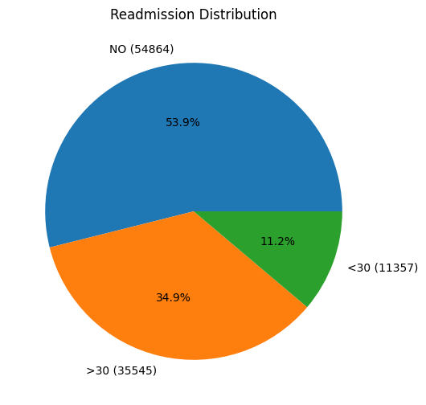

This histogram shows the distribution of patient’s length of stay in the hospital in days and we could see most patients (about 17 500) stayed for 3 days and overall most stayed for a short period as it shows the highest counts for 1-4 days. As the time in hospital increases, we can observe there are decreasing number of patients which shows that extended hospitalizations are not very common, so this skew can potentially cause my model to not generalize well for patients with long hospital stays due to less data cases.

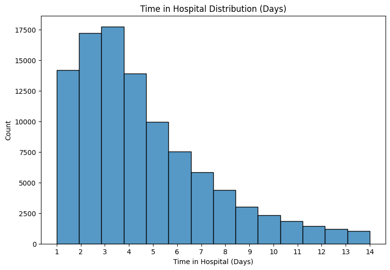

In terms of the boxplot graph showing the relationship between patient age groups and the time they spend in hospital, we can observe that older age groups have higher median hospital stays (4 days) compared to the younger demographics (2-3 days). For the middle to older age groups from 50 to 80, we could see that the box heights are the largest which indicates greater variability in the time of hospital stay. All age groups seem to have outliers suggesting some patients have much longer hospitalizations.

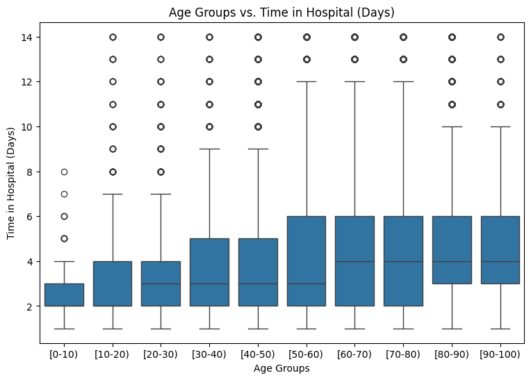

After generating a heatmap showing the correlation coefficients between the numerical features inside the dataset, we can observe each cell showing how 2 features are linearly related ranging from values -1 (for perfect negative correlation) to +1 (for perfect positive correlation). Most features have low correlations as they are close to 0 which shows they are mostly independent. However, we can observe the num_lab_procedures and time_in_hospital is 0.32 which shows the longer stays are associated with more lab procedures. The num_medications and time_in_hospital is 0.47 which means the patients who have to stay longer tend to receive more medications. Another example can be the num_medications and num_procedures which is 0.39 meaning that more procedures would mean more medications. Although the encounter_id and patient_nbr is 0.51, I think these identifiers’ correlations are not meaningful.

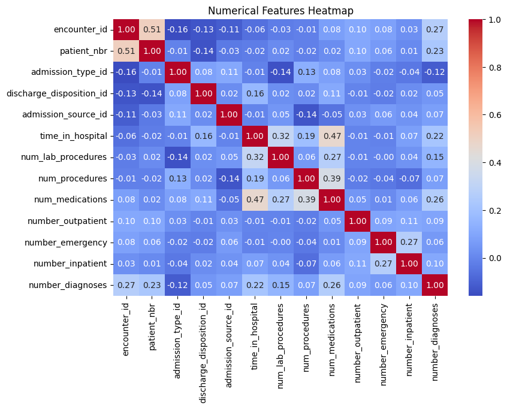

The final graph shows the relationship between gender and readmission. In both cases, the majority of patients in both groups were not readmitted with females at 29 038 and males at 25 823 with NO. Both also have the smallest groups being readmitted within 30 days as shown in the blue with 6152 females and 5205 males. Then, the patients readmitted after more than 30 days are still a medium size with 19 518 females and 16 027 males. One observation is that among all the categories, the number of female patients is higher than male patients, however I don’t believe this gender difference is very significant for readmission risk. There are also a few “Unknown/Invalid” records.

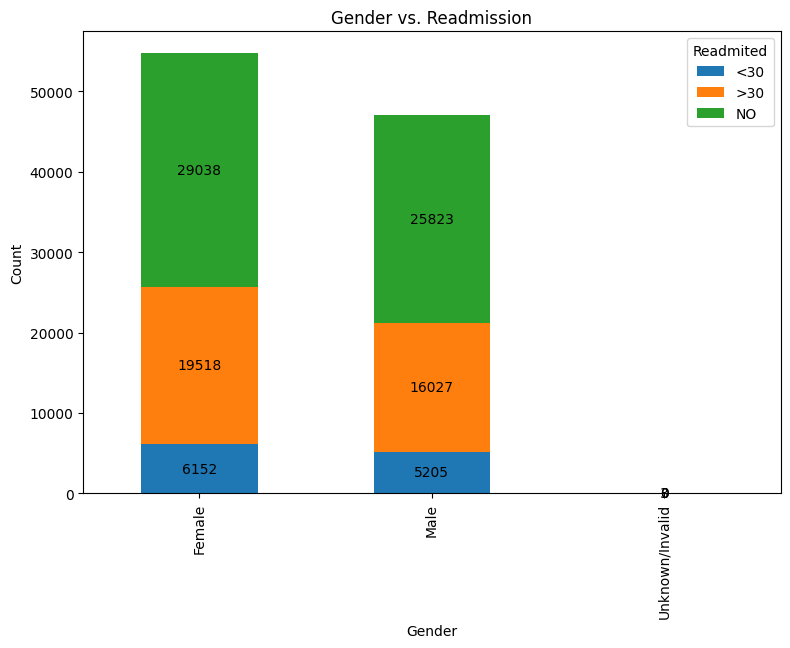

### Data Cleaning and Preprocessing

Several preprocessing steps were applied to improve data quality and model performance.

#### Diagnostic Code Transformation

The dataset contained many unique ICD diagnostic codes, creating high dimensionality.
To address this:

- Mapped ICD codes to broader clinical categories

- Reduced feature sparsity

- Improved model interpretability

#### Encoding and Target Preparation

- Applied label encoding to categorical features

- Converted target variable:

    + 1 → readmitted within 30 days

    + 0 → not readmitted within 30 days

#### Class Balancing

The original dataset was highly imbalanced.

To address this:

- Randomly sampled 10,000 records per class

- Combined and shuffled both classes

- Verified results by exporting intermediate CSV files

### Model Comparison

Two classification models were evaluated:

1. Logistic Regression

2. Random Forest Classifier

#### Rationale
The algorithms I chose to predict the 30-day readmission risk are logistic regression and random forest classifier. Since this is a classification problem for predicting the readmission risk  which is either a yes or a no, these algorithms would align with this healthcare risk prediction task. I first started with logistic regression because that is usually used as a standard baseline for these kinds of classification algorithms and it works well with large datasets as it is efficient and good at handling linear relationships. Then, I used random forest classifier because it is good for handling non-linear relationships to capture relationships between the features and the target. In addition, the algorithm is more efficient at handling the outliers since it aggregates results from many decision trees reducing the impact of noisy data. 

#### Training Pipeline
In terms of the implementation, I first created my dataset splitting it into 80% for training and 20% for testing in a random sampling manner. The feature matrix is stored in an x variable which would have all the feature columns except the readmitted while the target would be the y vector as that would be readmitted. Then, I start with the Logistic Regression model to create a pipeline that ensures the input features have similar scales to help converge faster for better performance before applying the Logistic Regression classification model. After this I set up a 5 fold cross validation grid search to perform hyperparameter tuning by using a parameter grid for different regularization strengths (C), solvers and max iterations for convergence. See images for hyperparameter tuning below.

#### Model Evaluation
After this I determined the best parameters and used that to create and train my final Logistic Regression model and then evaluate the predictions on the test set by considering precision, recall, F1 score, accuracy and RMSE. I repeat this process in a similar manner for the Random Forest Classifier model. However, now the grid search would consist of parameters related to that model like number of trees, max_features considered per split, maximum depth of each tree and min_samples_split. Then I ran the 5 fold cross validation to find the best model and parameters which I used to train my official model on the training set and make predictions on the test set. Finally, I evaluate the metrics the same way as before.

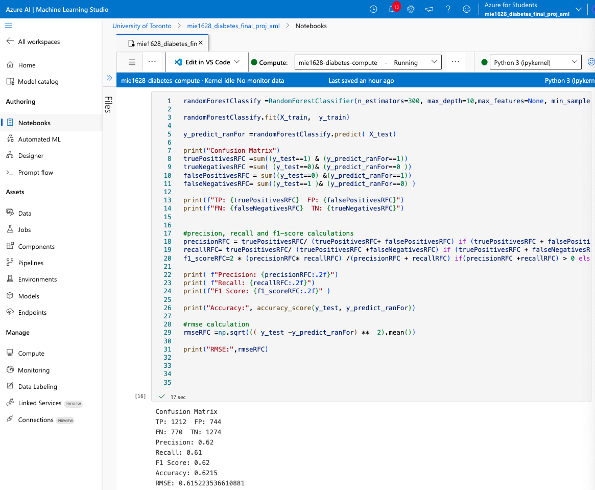

#### Model Performance Comparison

| Metric   | Logistic Regression | Random Forest |
| -------- | -------- | -------- |
| Accuracy | 0.587    | 0.6215   |
| Precision	| 0.60	  | 0.62     |
| Recall	| 0.51	  | 0.61     |
| F1-Score	| 0.55	  | 0.62     |

Comparing the performance of the 2 models, we can observe that the Random Forest Classifier outperforms the Logistic Regression on all metrics including higher precision, better recall, and a higher f1-score, higher accuracy and lower RMSE. As we can see from the confusion matrix, what this shows is that the Random Forest Classifier is able to better predict the patients that are readmitted and are actually readmitted, while Logistic Regression misses more true positives. The higher accuracy also means it is able to predict the readmission status more often overall while the lower RMSE shows that Random Forest’s probability predictions are closer to the actual outcomes. As a result, Random Forest Classifier is able to better capture the underlying patterns in the data for this problem and can more effectively identify the high-risk patients without increasing false positives too much.

### Automated Machine Learning (Azure AutoML)

An Azure AutoML experiment was conducted to automatically evaluate multiple algorithms.

#### Setup

1. Cleaned and preprocessed dataset in Azure Notebook

2. Generated CSV of processed data

3. Uploaded dataset to Azure ML Studio

4. Configured AutoML classification experiment

5. Target column: readmitted

AutoML evaluated models including:

- Logistic Regression

- LightGBM

- SGD

- ExtraTrees

- XGBoost

- Ensemble methods

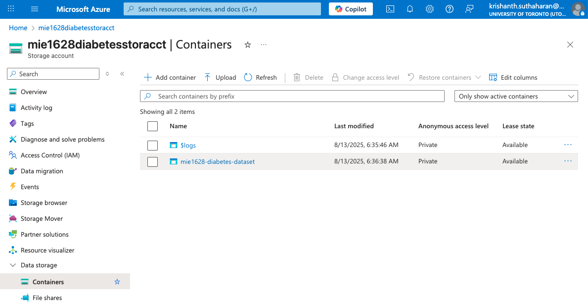

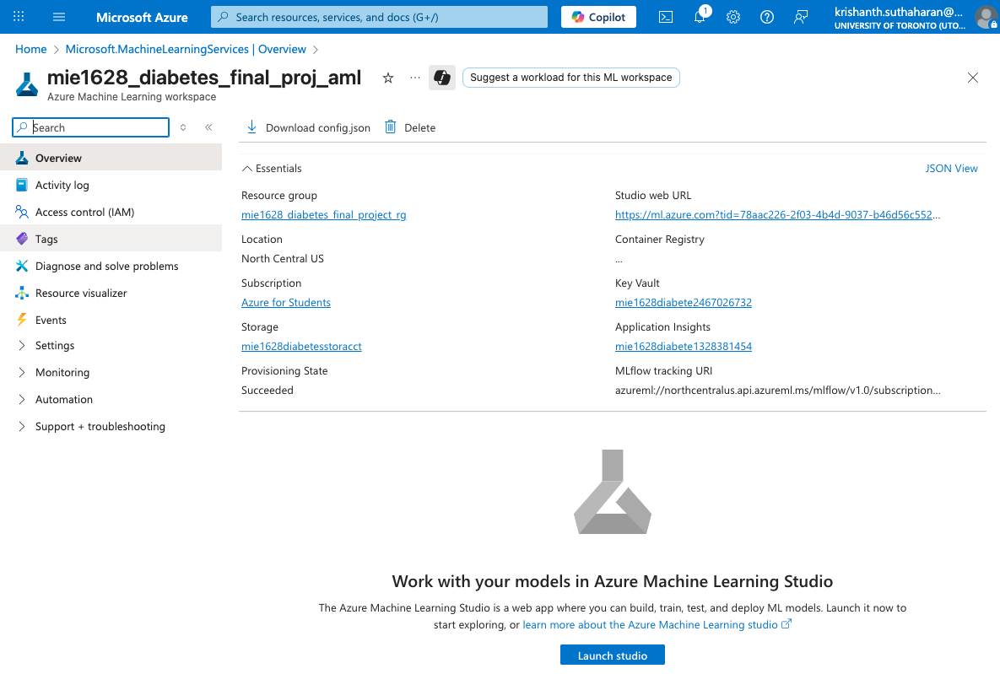

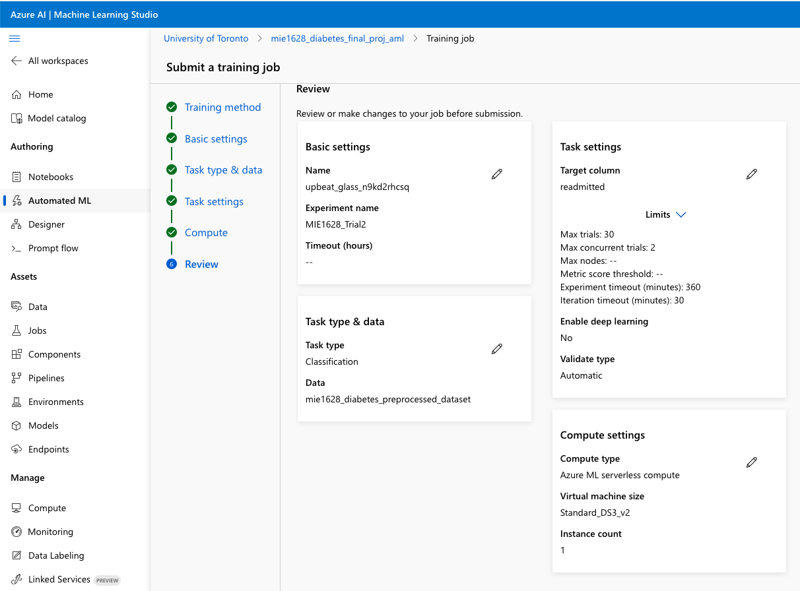

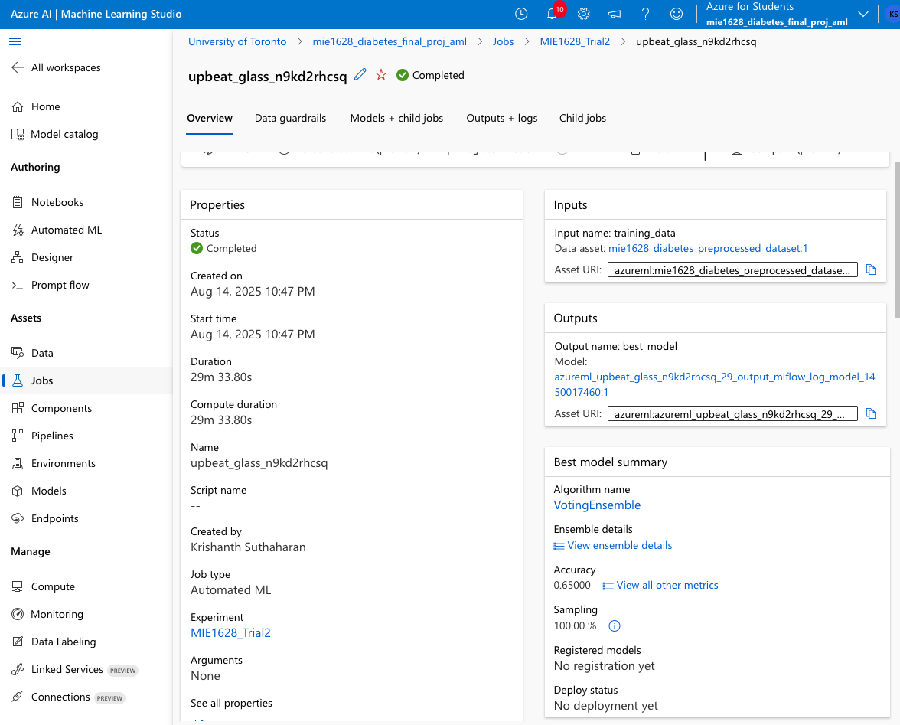

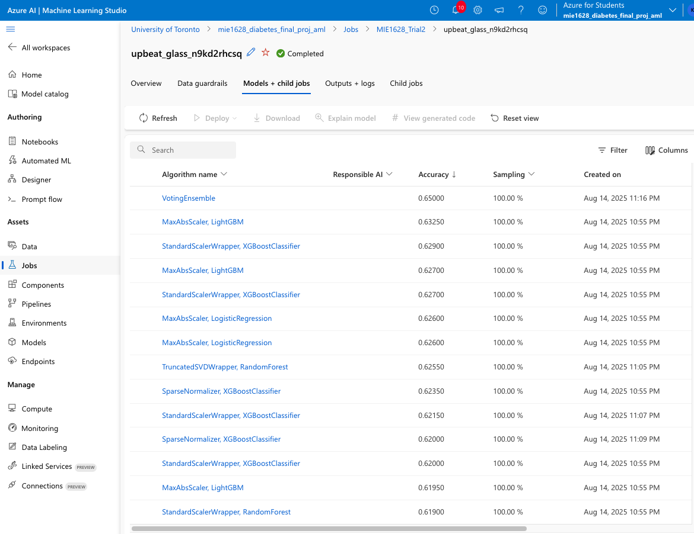

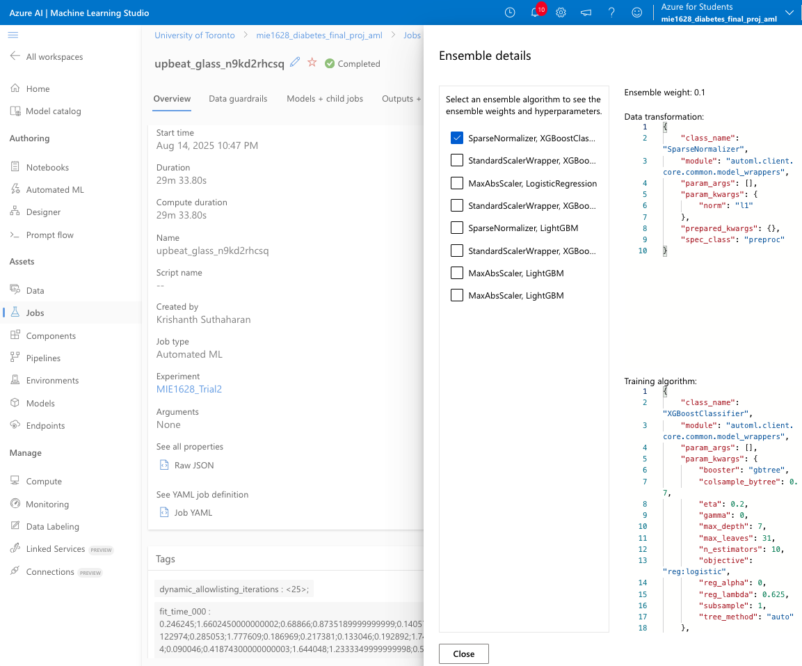

The best algorithm had the name of VotingEnsemble and the Automated ML found XGBoostClassifier to be the best model with parameters of max_depth=7, colsample_bytree=0.7, eta=0.2, n_estimator=10, reg_lambda=0.625, max_leaves=31, reg_lambda=0.625, etc. In terms of the results of the best model, we can observe that it has an accuracy of 0.65 and is able to correctly predict 65% of cases. We can observe that the Area Under the Curve for micro, macro and weighted are ~0.68 which means that the model is able to distinguish between classes. The F1 score is also ~0.65 which shows that the model is able to maintain a good balance between precision and recall to achieve reliable performance in predicting the negative and positive classes. The reason the XGBoostClassifier outperformed the other algorithms including the simpler ones like Logistic Regression is that this algorithm builds an ensemble of decision trees, which can capture complete, non-linear relationships between features and it is also robust to feature scaling. Since XGBoostClassifier combines multiple trees, the model is able to reduce bias and variance.  

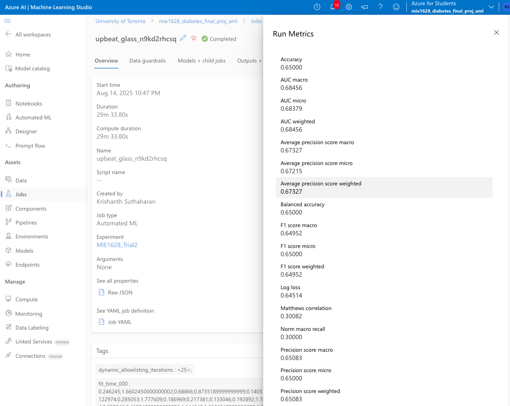

### Feature Importance Insights

#### Top predictors of readmission:

- number_inpatient

- discharge_disposition_id

- num_lab_procedures

- num_medications

- time_in_hospital

- age

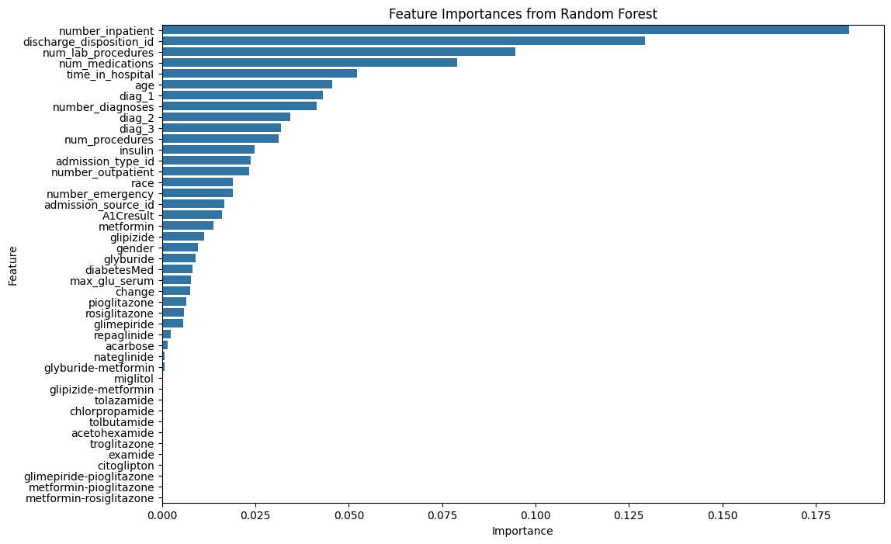

#### Key Observations

Patients showed significantly higher readmission risk with:

- More prior inpatient visits

- Longer hospital stays

- Higher medication counts

- Older age

### Conclusion

This project developed a machine learning pipeline to predict 30-day hospital readmissions for diabetic patients using the Diabetes 130-US Hospitals dataset.

- Random Forest outperformed Logistic Regression.

- Azure AutoML identified an XGBoost-based ensemble as the best model.

- Final model achieved 65% accuracy with balanced precision and recall.

#### Practical Impact

The model can help healthcare providers:

- Identify high-risk patients

- Schedule targeted follow-ups

- Personalize treatment plans

- Improve resource allocation

#### Future Improvements

- Incorporate outpatient follow-up data

- Perform deeper feature engineering

- Apply dimensionality reduction

- Explore deep learning models

### References

1. https://learn.microsoft.com/en-us/azure/stream-analytics/stream-analytics-quick-create-portal
2. https://archive.ics.uci.edu/dataset/296/diabetes+130-us+hospitals+for+years+1999-2008
3. https://pmc.ncbi.nlm.nih.gov/articles/instance/8104065/bin/ijpds-06-1406-s001.pdf
4. https://www.cdc.gov/pcd/issues/2024/24_0138.htm
5. https://vitalflux.com/gridsearchcv-logistic-regression-machine-learning-examples/
6. https://www.geeksforgeeks.org/dsa/random-forest-classifier-using-scikit-learn/
